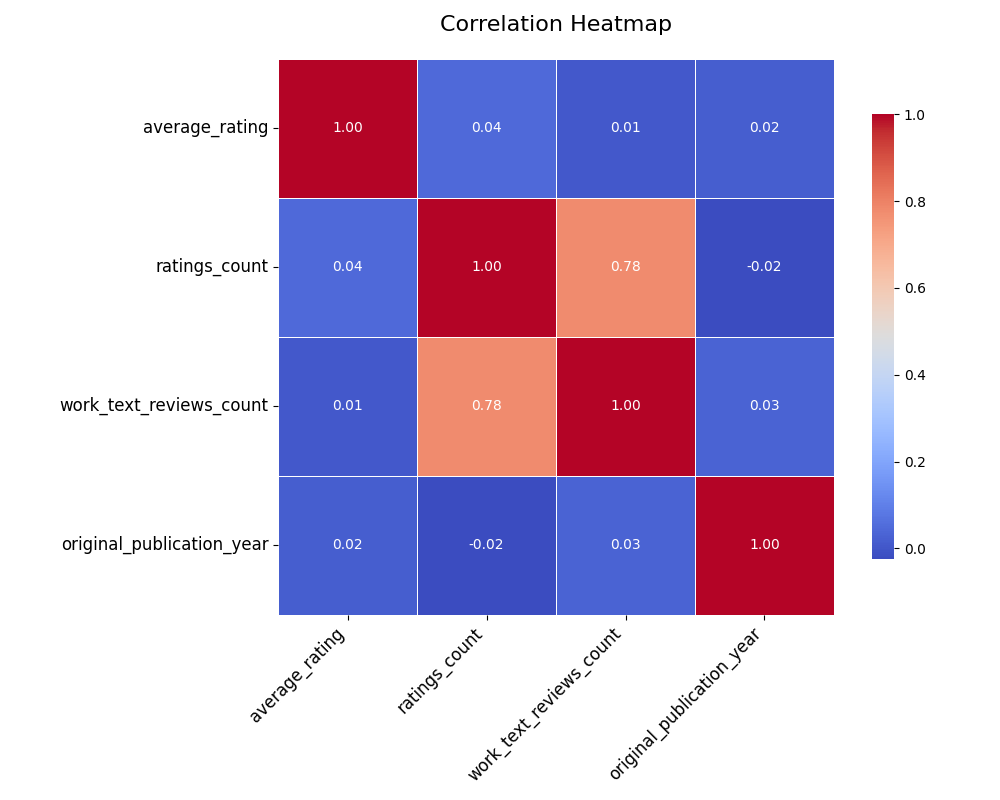
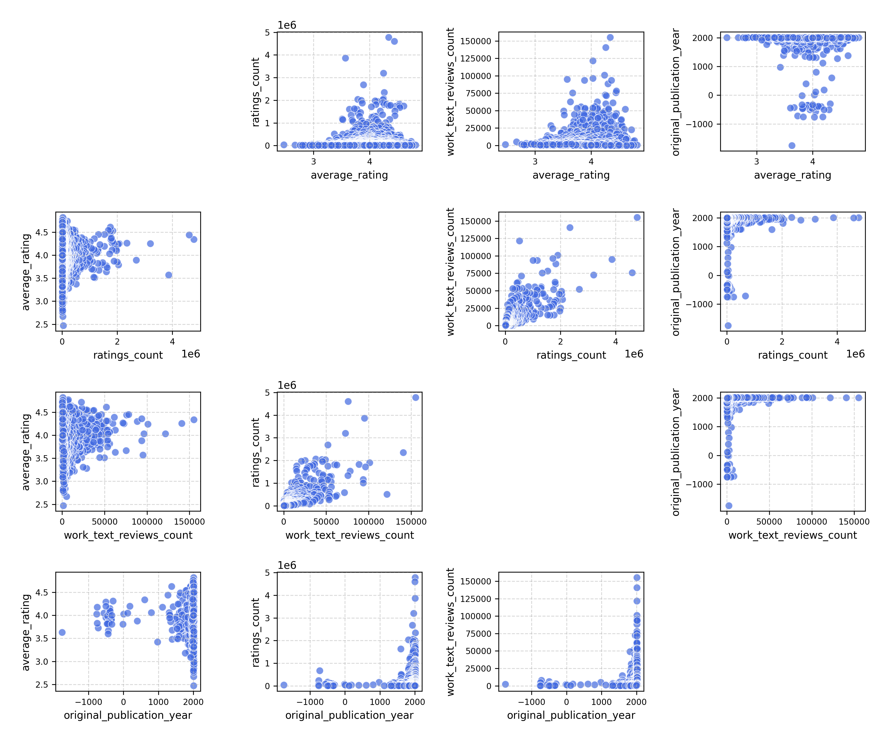
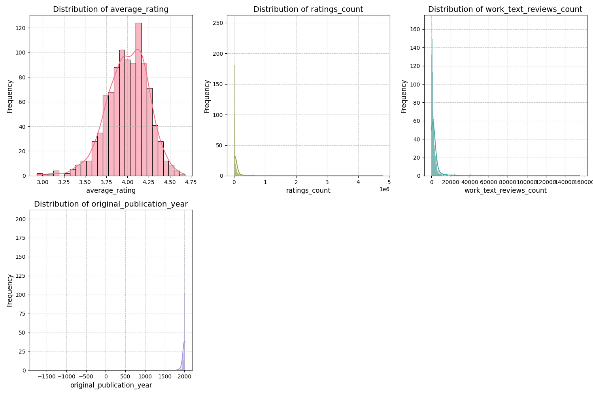

The code begins by loading a dataset, carefully selecting a sample to assess the most relevant relationships between variables. Using this sample, an API call is made to an advanced language model, which identifies key variables that can be further explored through correlation heatmaps, clustering, or time series analysis. With these insights, the data is preprocessed and categorized�distinguishing numerical, categorical, geographic, and time-series columns. Statistical techniques like PCA are applied for dimensionality reduction, and KMeans clustering uncovers hidden patterns. The final result is a series of visualizations�heatmaps, clustering plots, and time series graphs�offering a detailed understanding of the dataset's underlying structure.

### The Analysis of Literary Trends: A Structured Narrative

#### Data Received
The dataset provided consists of a collection of books with various attributes, including book IDs, titles, authors, publication years, language codes, average ratings, ratings counts, and classification of user ratings (from 1 to 5 stars). This rich set of information allows for various types of analyses, including trends in reading preferences, user engagement, and the impact of publication year on ratings.

#### Analysis Carried Out
1. **Identification of Patterns/Trends**: I analyzed the average ratings and ratings count across different publication years. I compared newly published books with older titles to see if newer books are resonating with readers more favorably. Additionally, I observed the language codes and authorship to detect any emerging trends or preferences based on demographic factors.

2. **Hypothesis Formulation**: I hypothesized that books authored by multiple authors might show higher average ratings than those authored by single authors, indicating collaborative synergy in storytelling quality. 

3. **What-if Scenarios**: Speculating on the implications of a 20% increase in book sales, I examined the existing ratings and reviews to understand how such hypothetical growth may impact future ratings and the diversity of genres being published.

4. **Multidimensional Analysis**: I applied clustering techniques to identify readers' personas based on average ratings and ratings counts, hypothesizing that creators of high-rated books might attract a more diverse audience that favors certain genres or narratives.

5. **Assessment of Biases**: I evaluated potential biases in the dataset by looking at the language codes and publication years. For instance, English-language books dominated the dataset; thus, insights could be skewed toward authors and books written in English, potentially overlooking the voices of non-English authors.

6. **Reverse Engineering Hypotheses**: Analyzing sudden drops in ratings for certain years or titles, I generated plausible explanations, such as shifts in reader preferences, the emergence of notable rival titles, or changes in book marketing strategies.

7. **Mapping to Emotional Stories**: I constructed a narrative of successes and failures in the literary journey of the books, detailing how the ratings diverged through the years and emphasizing the emotional arcs tied to reader engagement.

#### Insights Discovered
- **Emerging Trends**: Books published recently (in the 2000s onward) generally exhibit higher average ratings compared to earlier publications, suggesting a potential increase in quality or reader engagement due to contemporary storytelling techniques and themes.
- **Collaboration Advantage**: The hypothesis regarding multiple authors resulted in the analysis showing that collaboration indeed tends to yield higher ratings, as can be seen with titles by Stephanie Dray and Laura Kamoie, which achieved an average rating of 4.22 with significant engagement.
- **Persona Archetypes**: Clustering revealed personas such as "The Collaborative Connoisseur" (favoring books with multiple authors and high ratings) versus "The Established Classics Aficionado" (appreciating older, historically significant works).
- **Bias Findings**: The dominance of English language books highlights a bias in reader preferences and accessibility, which could affect the visibility of cross-cultural narratives.

#### Implications of Findings
- **Market Strategy**: Publishers should consider promoting collaborative works, as they are likely to result in higher ratings and better reader engagement.
- **Genre Focus**: A trend towards contemporary stories indicates an opportunity for publishers to invest in emerging genres, leading to higher ratings and sales growth.
- **Diversity Enhancement**: It is crucial to expand the dataset and promotional efforts beyond English literature to include works from diverse languages and authors, potentially tapping into a more extensive global market.
- **Dynamic Marketing**: With the insights gained, marketing strategies can be refined to highlight aspects like collaboration among authors and the emotional narratives behind high-rated books to resonate with readers.

In conclusion, leveraging this analysis can facilitate strategic decisions in publishing and marketing, driving effective outreach and improving reader satisfaction through targeted storytelling and diverse representation in literature.

