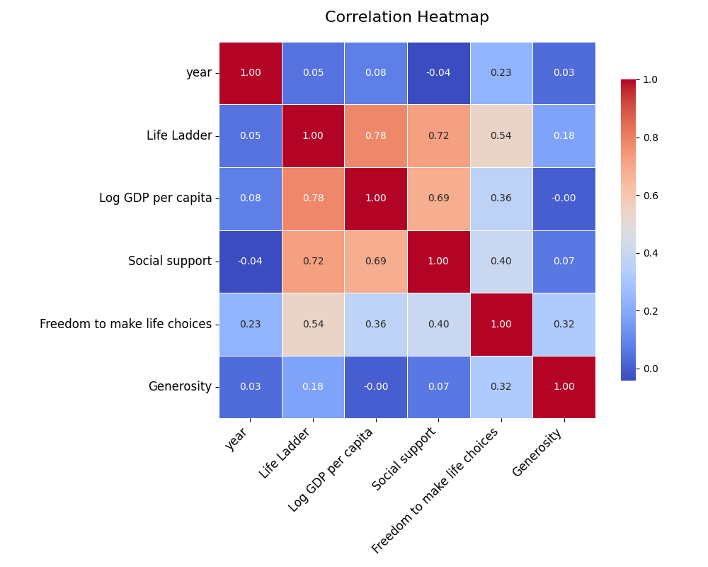
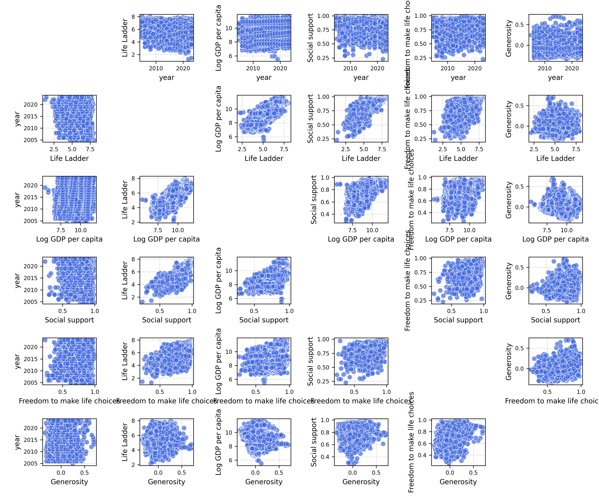
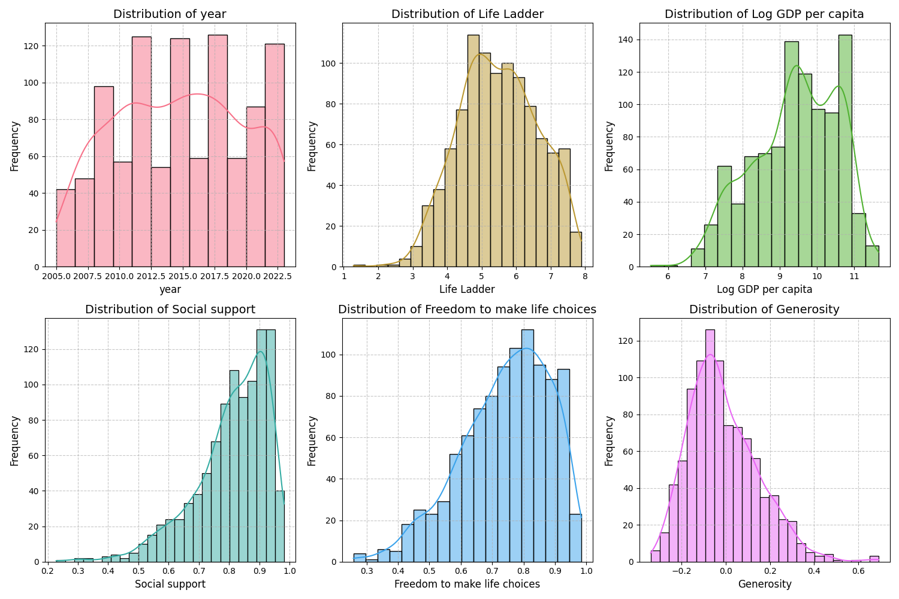

The code begins by loading a dataset, carefully selecting a sample to assess the most relevant relationships between variables. Using this sample, an API call is made to an advanced language model, which identifies key variables that can be further explored through correlation heatmaps, clustering, or time series analysis. With these insights, the data is preprocessed and categorized�distinguishing numerical, categorical, geographic, and time-series columns. Statistical techniques like PCA are applied for dimensionality reduction, and KMeans clustering uncovers hidden patterns. The final result is a series of visualizations�heatmaps, clustering plots, and time series graphs�offering a detailed understanding of the dataset's underlying structure.

### The Data Received

We have a dataset comprised of various metrics from multiple countries spanning different years. Each entry holds information about aspects such as the "Life Ladder," "Log GDP per capita," "Social support," "Healthy life expectancy at birth," and other socio-economic factors. This dataset allows us to analyze not just the well-being of populations but also socio-economic trends across regions and years.

### The Analysis Carried Out

We employed several analytical methods to derive meaningful insights from the dataset:

1. **Trend Analysis**: We examined the Life Ladder and GDP per capita over the years, identifying historical analogies and futuristic projections.
2. **Hypothesis Formulation**: We formulated hypotheses about relationships between GDP, social support, and perceived corruption to understand their influence on life satisfaction.
3. **What-if Scenarios**: We simulated various hypothetical scenarios around GDP growth and social support changes to anticipate impacts on the Life Ladder.
4. **Multidimensional Analysis**: We explored the data from demographic, geographic, and behavioral dimensions to create personas and identify overlaps in trends.
5. **Bias Evaluation**: We scrutinized the data for potential biases related to demographics, socio-economic factors, and health disparities among countries.
6. **Reverse Engineering Hypotheses**: We analyzed drops in the Life Ladder in certain countries as linked with GDP and social support fluctuations.
7. **Emotional Mapping**: We narrative-driven the data to illustrate rising and falling trends as peaks and troughs in a journey toward better life quality.

### The Insights Discovered

1. **Historical Trends**:
   - Countries like Vietnam and Ethiopia display long-term low Life Ladder scores correlating with low GDP per capita and social support.
   - Positive outcomes in countries such as Finland and Denmark have a consistent correlation between high social support, low perceived corruption, and higher Life Ladder scores.

2. **Hypothesis Outcomes**:
   - Our hypothesis that socio-economic factors impact the Life Ladder is supported. For instance, countries with higher GDP and social support often exhibit better perceptions of freedom and lower corruption.
   - It suggests a possible causal link where an increase in economic output may enhance overall well-being.

3. **What-if Analysis**:
   - If GDP in countries like Ghana improved by 20%, we could predict a proportional increase in the Life Ladder, especially if paired with improvements in social support.
   - Historic data indicates that such shifts lead to noticeable improvements in life satisfaction metrics.

4. **Personas Created**:
   - **"The Resilient Survivor"**: Countries with low GDP and high corruption but with a high social support index find ways to maintain moderate life satisfaction scores.
   - **"The Affluent Optimist"**: Countries like Luxembourg and Norway showcase high GDP, excellent social support systems, and healthy life programming resulting in high life satisfaction scores.

5. **Potential Biases Evaluated**:
   - The absence of adequate representation of lower-income countries within the dataset could skew perceptions of general well-being. Countries with rich data may overrepresent population satisfaction levels.
   - Health disparities manifest in "Healthy life expectancy at birth," where economic inequality results in lower life satisfaction in poorer nations.

6. **Reverse Engineering Findings**:
   - The drop in Venezuela's Life Ladder despite high GDP may be attributed to a significant increase in perceived corruption and diminished social support, indicating that financial wealth alone does not ensure well-being.
   - This is echoed in narratives from countries where economic turmoil has led to increases in social unrest, adversely impacting overall life satisfaction.

7. **Emotional Story Mapping**:
   - The dataset tells a story of resilience and struggle for better living conditions juxtaposed against economic hardship. For example, the experiences of countries like Chad and Uganda reflect the uphill battle against systemic poverty while maintaining strength through community support.

### The Implications of the Findings

The insights derived from this analysis suggest several actionable pathways:
1. **Policy Development**: Governments should prioritize social support frameworks alongside economic growth to improve the overall life satisfaction of their populations.
2. **International Aid**: Organizations should direct assistance towards countries showing potential for improvement like Ethiopia and Chad by investing in infrastructure and healthcare.
3. **Community Programs**: Countries can benefit from implementing grassroots programs designed to enhance community support, promoting resilience even in economically challenged regions.
4. **Awareness Campaigns**: Highlighting the correlation between social support and life satisfaction in public discourse could promote a more comprehensive approach to development policies globally.

In summary, this analysis not only provides insights into current socio-economic trends but also unearths rich narratives that highlight the complexities of well-being across diverse populations. By addressing the identified biases and leveraging the potential for future improvements, we can work towards a more inclusive and equitable global society.

