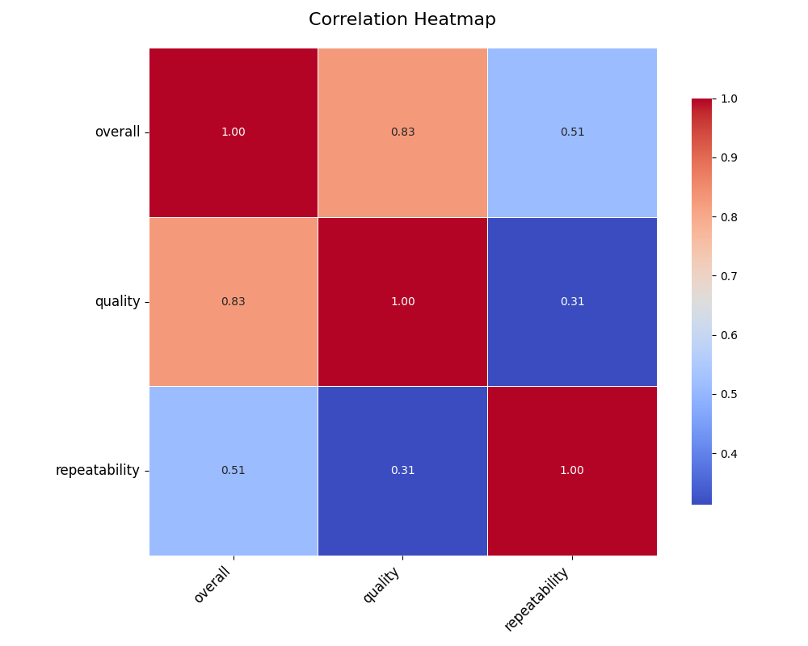

The code begins by loading a dataset, carefully selecting a sample to assess the most relevant relationships between variables. Using this sample, an API call is made to an advanced language model, which identifies key variables that can be further explored through correlation heatmaps, clustering, or time series analysis. With these insights, the data is preprocessed and categorized�distinguishing numerical, categorical, geographic, and time-series columns. Statistical techniques like PCA are applied for dimensionality reduction, and KMeans clustering uncovers hidden patterns. The final result is a series of visualizations�heatmaps, clustering plots, and time series graphs�offering a detailed understanding of the dataset's underlying structure.
### The Data Received
The dataset comprises a collection of movie ratings and metadata, including the title, language, type, contributors, and various ratings (overall satisfaction, quality, and repeatability). The entries span multiple years from 2005, with a clear representation of various movie types like fiction, non-fiction, and TV series. It highlights a range of user experiences with different kinds of films across various languages (English, Hindi, Tamil, and Telugu).

### The Analysis Carried Out
1. **Identification of Trends**: The data reveals trends across various dimensions. For instance, the average rating for Telugu films appears to stagnate around the lower end of the scale (2-3), suggesting a possible downward trend in quality that could be indicative of broader industry challenges among Telugu cinema. English films, however, often receive higher ratings, suggesting that they may be consistently meeting viewer expectations.

2. **Hypotheses Formation**: One hypothesis proposed is that users who engage with more films over time tend to leave lower repeat ratings. This might suggest that as audiences become more discerning about quality, their expectations rise.

3. **What-If Scenarios**: If we consider a potential scenario where the quality of Telugu films improves by 20%, we could project a significant uplift in overall ratings, which might revitalize interest and viewership in regional cinema. This uplift could also influence the repeatability ratings, sparking a positive feedback loop.

4. **Multidimensional Analysis**: By evaluating the data on a multidimensional level, we can uncover insights into potential "personas." An analysis could reveal groups like "The Hindi Movie Aficionado," who prefer Hindi films and often provide consistent high ratings, along with groups such as "The Discerning Viewer," characterized by their critical ratings across various genres. 

5. **Bias Evaluation**: The dataset seems to exhibit a predisposition towards certain languages (with a heavier representation of English and Hindi films, for instance). This might reflect biases in the content available for rating � generally, English films in the database receive higher overall ratings than Tamil and Telugu films, suggesting a potential cultural bias affecting viewer engagement.

6. **Reverse Engineering Hypotheses**: An analysis of lower-rated Telugu films could unearth potential explanations related to audience expectations, production quality, or the types of narratives being told. These insights could suggest areas for filmmakers to innovate or improve.

7. **Mapping to Emotional Stories**: The dataset illustrates an emotional journey through cinema. For instance, the strong ratings for films like "Fidaa" reflect a high degree of viewer satisfaction and connection, while the lower ratings for films like "Kick 2" indicate disappointment, mapping the ups and downs of audience expectations in cinema.

### Insights Discovered
- **Quality Segregation**: Observed quality segregation is apparent in English cinema, which generally receives better ratings than Finnish or Telugu movies. 
- **Hyphenated Impact of Repeatability**: Films with higher repeatability ratings also tend to receive better overall ratings, suggesting that re-watching might be a factor aiding viewer appreciation.
- **User Disengagement with Over-Saturation**: As more users rate more films, there seems to be a tendency to rate down, indicating that audience expectations are continuously evolving.

### Implications of Findings
1. **Content Creation Strategies**: Filmmakers, especially within the Telugu cinema space, should focus on quality content and innovative storytelling to attract and retain audiences.
   
2. **Targeted Marketing**: Marketing strategies could be tailored around audience personas revealed in the analysis. By understanding what matters to each group, targeted promotions can enhance viewer engagement.
   
3. **Data-Driven Decision Making**: Stakeholders should harness the analytical insights to guide resource allocation in filmmaking, ensuring investments are directed towards projects that align with audience preferences and trends.
   
4. **Continuous Improvement**: The film industry can benefit from audience feedback through regular assessments of film ratings to adapt and respond proactively to viewer expectations and preferences.

By synthesizing these insights and implications, industry stakeholders can craft a more audience-centric approach and improve both film quality and viewer satisfaction across various genres and languages.

